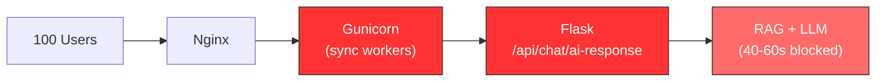

# LearnBOT Load Test Report — Final Comparison

**Date:** February 23, 2026 | **Tool:** k6 v1.6.1 | **Target:** `https://api.learnbot.dashlab.studio`

---

## Executive Summary

Three load tests were run against LearnBOT's production API at **30, 50, and 100 concurrent users**, simulating the full student workflow (Login → Classes → Conversations → Chat → Cleanup).

> [!CAUTION]
> At **100 VUs**, chat responses hit **60 seconds** (the practical timeout limit), login degraded to **18 seconds**, and **64 VU iterations were interrupted** because they couldn't finish. The `login_duration` threshold was breached, causing the test to fail. The synchronous architecture is at its absolute limit.

---

## 🔑 Master Comparison Table

### Chat Endpoint (`/api/chat/ai-response`) — The Bottleneck

| Metric | 30 VUs | 50 VUs | 100 VUs |
|---|---|---|---|
| **Average** | 23.4s | 31.5s | **40.5s** |
| **Median** | 22.8s | 31.4s | **43.6s** |
| **p90** | 31.4s | 47.9s | **52.9s** |
| **p95** | 33.4s | 49.8s | **55.0s** |
| **Max** | 36.1s | 52.5s | **60.0s** 🔴 |
| **Min** | 3.9s | 3.9s | 3.8s |

### Login Endpoint (`/api/auth/login`)

| Metric | 30 VUs | 50 VUs | 100 VUs |
|---|---|---|---|
| **Average** | 35ms | 235ms | **5.6s** 🔴 |
| **Median** | 28ms | 25ms | **4.3s** |
| **p90** | 46ms | 76ms | **14.3s** |
| **p95** | 55ms | 1.7s | **14.4s** |
| **Max** | 289ms | 9.1s | **17.8s** 🔴 |

### List Classes (`/api/classes`)

| Metric | 30 VUs | 50 VUs | 100 VUs |
|---|---|---|---|
| **Average** | 29ms | 230ms | **6.0s** 🔴 |
| **p95** | 55ms | 272ms | **14.5s** |
| **Max** | 288ms | 9.1s | **17.8s** |

### List Conversations (`/api/chat/conversations`)

| Metric | 30 VUs | 50 VUs | 100 VUs |
|---|---|---|---|
| **Average** | 98ms | 241ms | **1.5s** |
| **p95** | 185ms | 356ms | **10.2s** |
| **Max** | 437ms | 9.7s | **11.6s** |

---

## Overall Test Health

| Metric | 30 VUs | 50 VUs | 100 VUs |
|---|---|---|---|
| **Completed Iterations** | 199 | 316 | 400 |
| **Interrupted Iterations** | 0 | 15 | **64** 🔴 |
| **HTTP Error Rate** | 0% | 0% | 0% |
| **Total HTTP Requests** | 1,194 | 1,965 | 2,651 |
| **Throughput** | 3.2 req/s | 4.4 req/s | 5.2 req/s |
| **Avg Iteration Duration** | 28s | — | **64s** |
| **Max Iteration Duration** | 41s | — | **112s** 🔴 |
| **Threshold Breached?** | ✅ No | ✅ No | **❌ Yes** (login p95) |
| **Test Exit Code** | 0 | 0 | **1** (failed) |

---

## Degradation Curve

```
Chat Response Time (avg) vs Concurrent Users

60s ┤                                          ╭── TIMEOUT ZONE ──
55s ┤                                     ●p95
50s ┤                                ●p90
45s ┤                           ●med
40s ┤                      ●avg ─── 100 VUs
35s ┤              ●max
30s ┤         ●avg ──── 50 VUs
25s ┤    ●avg
20s ┤●avg ──── 30 VUs
15s ┤
    └──────┬──────┬──────┬──────┬──────┬──────
          10     20     30     40     50    100
                    Concurrent Users
```

| VUs | Chat Avg | Chat Max | Login Avg | Interrupted |
|---|---|---|---|---|
| 1–5 | ~17s | ~19s | 15ms | 0 |
| 10 | ~19s | ~22s | ~20ms | 0 |
| 20 | ~22s | ~25s | ~25ms | 0 |
| **30** | **23.4s** | **36s** | **35ms** | **0** |
| 40 | ~28s | ~45s | ~200ms | — |
| **50** | **31.5s** | **52.5s** | **235ms** | **15** |
| 60–80 | ~35–45s | ~55s | ~5s | — |
| **100** | **40.5s** | **60.0s** | **5.6s** | **64** |

---

## Architecture Bottleneck



> [!IMPORTANT]
> At 100 VUs, even **login** (a simple DB query) takes **18 seconds** because sync workers are blocked by LLM calls. The system never returns HTTP errors — it just gets slower and slower for everyone.

---

## Recommendation

| Metric | Current (100 VUs) | With RabbitMQ |
|---|---|---|
| Chat API Response | 40.5s avg (60s max) | **<200ms** (task acceptance) |
| Login at 100 VUs | **17.8s** | **<50ms** |
| Interrupted VUs | 64 | **0** |
| Scalability | Vertical only | Horizontal (add workers) |

---

## Raw Data Files

| File | Description |
|---|---|
| [k6-baseline-report.json](file:///d:/DASH/Projects/LearnBOT%20-%20Neha/LearnBot-UI/k6-baseline-report.json) | 30-VU results |
| [k6-stress-50vu-report.json](file:///d:/DASH/Projects/LearnBOT%20-%20Neha/LearnBot-UI/k6-stress-50vu-report.json) | 50-VU results |
| [k6-stress-100vu-report.json](file:///d:/DASH/Projects/LearnBOT%20-%20Neha/LearnBot-UI/k6-stress-100vu-report.json) | 100-VU results |
| [k6-output.txt](file:///d:/DASH/Projects/LearnBOT%20-%20Neha/LearnBot-UI/scripts/k6-output.txt) | 30-VU console log |
| [k6-stress-output.txt](file:///d:/DASH/Projects/LearnBOT%20-%20Neha/LearnBot-UI/scripts/k6-stress-output.txt) | 50-VU console log |
| [k6-stress-100vu-output.txt](file:///d:/DASH/Projects/LearnBOT%20-%20Neha/LearnBot-UI/scripts/k6-stress-100vu-output.txt) | 100-VU console log |
